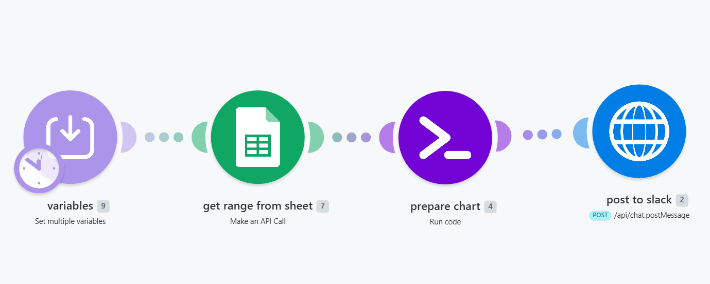

# make-post-sheet-data-as-chart-to-slack
Read weekly data from a Google Sheet, generate a bar chart, post it to Slack with auto week-over-week comparison.

# Google Sheets to Slack Chart: Auto-generate weekly bar charts

Reads a row of weekly data from a Google Sheet, builds a styled bar chart 
using QuickChart.io (free, no API key), and posts it to Slack with an 
automatic week-over-week comparison line.

Built for solo founders and small ops teams who want a no-code weekly 
revenue/metrics digest without paying for charting tools.

## What you get

- A Slack message with a chart image
- Bars colored on a gradient (low values red, high values green)
- A comparison line below the chart: "Sales in Week 22 is 14,320 ▲ 2,100 (17.2%) vs prev week"
- Configurable to show the last N data points

## What you need

- Make.com account (free tier works)
- Google account with access to your sheet
- Slack workspace with a bot token
- A Google Sheet with two rows: labels in row 1 (Week 1, Week 2...), values in row 2

## Setup (5 min)

1. Download [Download workflow.json](make-post-sheet-data-as-chart-to-slack.blueprint.json)
2. In Make.com: Create scenario → ••• → Import Blueprint → select the file
3. Open Module 9 (Set Variables) and fill in:
   - `spreadsheetID` - your Google Sheet ID (the long string in the URL)
   - `sheetName` - tab name in your sheet (e.g. "Sales 2026")
   - `dataValuesRange` - cell range for your two rows (e.g. "A1:Z2")
   - `slackChannelID` - the Slack channel ID where the chart will post
   - `slackBotToken` - your Slack bot token (starts with xoxb-)
   - `lastXtoShowOnChart` - how many recent data points to display (default: 12)
4. Click the Google Sheets module, connect your Google account
5. Run

## How it works

1. **Set Variables** - holds your spreadsheet ID, sheet name, range, Slack channel, token
2. **Google Sheets API** - reads the data range you specified
3. **Execute Code (JavaScript)** - parses the row, builds a Chart.js config, generates a QuickChart.io image URL, formats the Slack message blocks, calculates the week-over-week delta
4. **HTTP POST** - sends the chart to Slack via `chat.postMessage`

## Sheet format expected

| Week 1 | Week 2 | Week 3 | Week 4 | ... |
|--------|--------|--------|--------|-----|
| 12000  | 13500  | 11200  | 14320  | ... |

- Row 1: labels matching the pattern "Week 1", "Week 2", etc.
- Row 2: numbers (commas and spaces are stripped automatically)
- Empty cells are skipped
- The script picks the last N valid pairs

## Customizing

**Change the chart title:** edit line in the code editor:
```javascript
text: `Weekly Sales : last ${values.length} weeks`
```

**Change "Sales" label:** edit:
```javascript
label: 'Sales'
```

**Change colors:** the gradient runs hue 0 to 130 (red to green). Edit:
```javascript
const hue = Math.round(r * 130);
```

**Use months/days instead of weeks:** change the regex in the code:
```javascript
if (/^Week\s*\d+/i.test(label) ...
```
Replace `Week` with `Month` or remove the regex entirely to accept any label.

## Schedule

Set the scenario to run weekly (Monday 09:00) to get an automatic weekly digest. 
Or trigger via webhook if you want on-demand chart generation.

## Screenshot



## Why this exists

Make has no native chart-generation module. Most "send chart to Slack" tutorials 
require Plotly, Highcharts, or a paid charting service. This uses QuickChart.io 
which is free, requires no key, and renders Chart.js configs directly.

## Built by Ozan Atmar

I build Make.com automations and web apps for founders.  
Site: https://ozan.at/mar  
Email: ozanatmar@gmail.com
